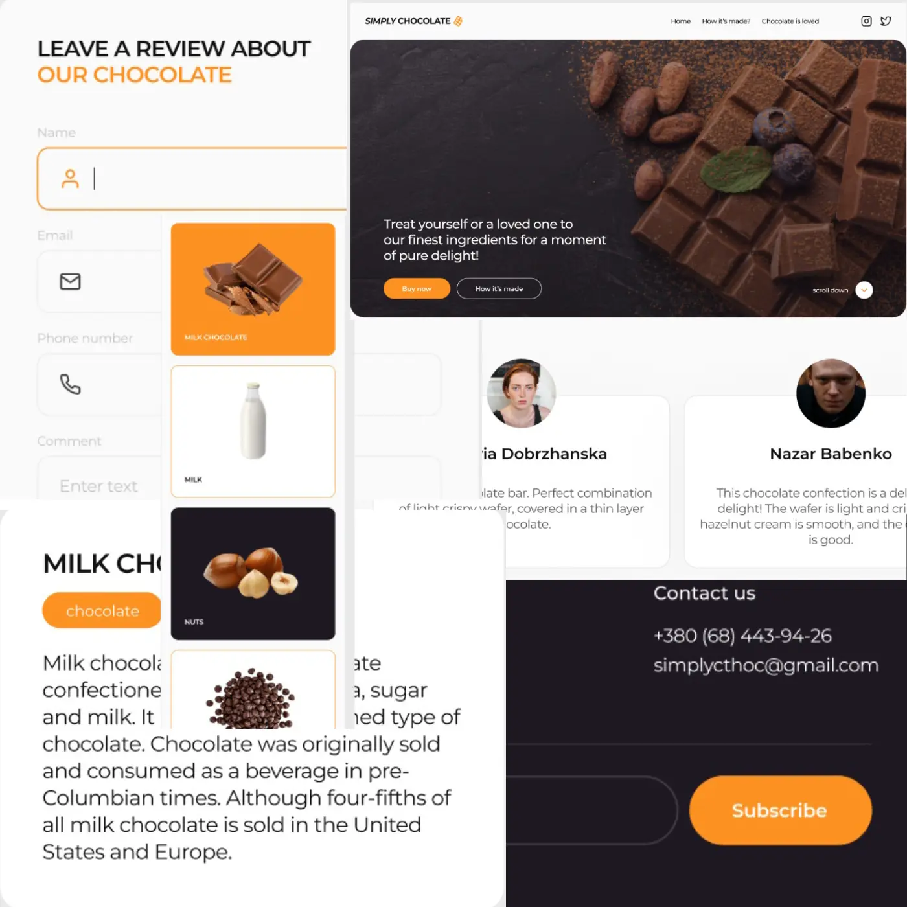

# 🍫 Simply Chocolate



A modern landing page for a premium chocolate brand, built with React + Vite as part of my frontend learning journey.

## 🚀 Live Demo

[simply-chocolate.vercel.app](https://simply-chocolate.vercel.app)

## 🛠️ Tech Stack

- **React 18** — component-based UI
- **Vite** — blazing fast build tool
- **CSS Modules** — scoped, conflict-free styles
- **Responsive Design** — mobile / tablet / desktop

## 📦 Features

- 📱 Fully responsive — 3 breakpoints (375px / 768px / 1200px)
- 🍔 Mobile menu with scroll lock
- 🎨 Hover overlays on ingredient cards
- 🖼️ Adaptive images with 1x/2x retina support
- 💬 Review modal with controlled form & validation
- ✉️ Newsletter subscription form in footer
- ♿ Accessible markup — semantic HTML, aria-labels

## 🏗️ Project Structure

src/
├── components/
│ ├── Header/
│ ├── MobileMenu/
│ ├── Hero/
│ ├── Benefits/
│ ├── Taste/
│ ├── Made/
│ ├── Reviews/
│ ├── Footer/
│ └── Modal/
├── styles/
│ └── global.css
└── App.jsx

## 🚀 Getting Started

```bash
# Clone the repo
git clone https://github.com/Bashmachok1982/Simply-Chocolate-react-vite-Alex.git

# Install dependencies
npm install

# Start dev server
npm run dev

# Build for production
npm run build
```

## 📚 What I Learned

This project was built while studying React fundamentals:

- `useState` & `useEffect` hooks
- Props & lifting state up
- Controlled forms
- CSS Modules
- Component architecture
- Responsive images with `<picture>` tag

---

Design based on [Simply Chocolate](https://www.figma.com/design/V0iVV3ZPME2xnuGZVjVKDj/) Figma mockup.

Made with ❤️ and a lot of 🍫
